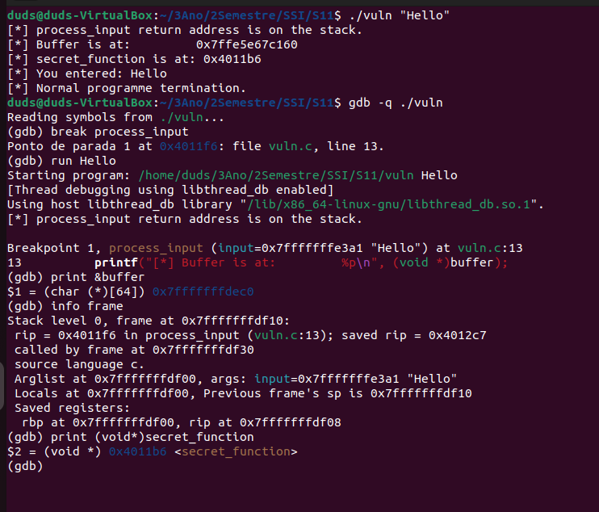

# Exercício 2: Análise da Stack com GDB

**Sessão GDB realizada em:** `/home/duds/3Ano/2Semestre/SSI/S11/vuln`



---

## QUESTÃO 1: Endereço do buffer

```
(gdb) print &buffer
$1 = (char (*)[64]) 0x7fffffffdec0
```

**Resposta:** O buffer "buffer" está localizado no endereço `0x7fffffffdec0`

**Explicação:** Este é o endereço inicial de 64 bytes alocados na stack para armazenar a entrada do utilizador. Um buffer overflow ocorre ao escrever mais de 64 bytes nesta localização.

---

## QUESTÃO 2: Endereço do return address (saved RIP)

```
(gdb) info frame
Stack level 0, frame at 0x7fffffffdf10:
 rip = 0x4012c8 in process_input (vuln.c:13); saved rip = 0x4012c7
 called by frame at 0x7fffffffdf30
```

**Resposta:** 
- O return address (saved RIP) está armazenado em: `0x7fffffffdf10`
- O valor do return address é: `0x4012c7`

**Explicação:** O return address é o endereço da instrução que deve executar quando `process_input()` retorna à função `main()`. Se sobrescrevermos este valor com o endereço de `secret_function`, o programa saltará para lá quando a função terminar.

---

## QUESTÃO 3: Distância entre o buffer e o return address (offset)

**Cálculo:**
```
Endereço do frame (onde está guardado o return address): 0x7fffffffdf10
Endereço do buffer: 0x7fffffffdec0
Diferença: 0x7fffffffdf10 - 0x7fffffffdec0 = 0x50 = 80 (decimal)
```

**Resposta:** O offset entre o buffer e o return address é **80 bytes** (ou `0x50` em hexadecimal)

**Explicação:** Para sobrescrever o return address com um buffer overflow, é necessário escrever exatamente 80 bytes no buffer para atingir a posição do return address. Os primeiros 64 bytes preenchem o buffer, e os próximos 16 bytes preenchem a diferença até ao return address (provavelmente devido a alignment e outras variáveis locais na stack frame).

---

## QUESTÃO 4: Endereço da função secret_function

```
(gdb) print (void*)secret_function
$2 = (void *) 0x401186 <secret_function>
```

**Resposta:** A função `secret_function` está localizada no endereço `0x401186`

**Explicação:** Este é o endereço de instrução onde a função `secret_function` começa no segmento de código (text segment). Para explorar o buffer overflow, escreveremos este endereço no return address. Quando `process_input()` retorna, o programa saltará para este endereço em vez de retornar para `main()`.

---

## RESUMO PARA O EXPLOIT

Com base nesta análise, para explorar o buffer overflow:

1. Escreveremos 80 bytes de "lixo" no programa
2. Depois escreveremos o endereço `0x401186` (em formato little-endian para x86-64)
3. Isto sobrescreverá o return address armazenado na stack
4. Quando `process_input()` retorna, o programa saltará para `secret_function()` em vez de voltar para `main()`

O input necessário será algo como:
```
AAAA...AAAA (80 bytes) + 0x401186 (em little-endian: \x86\x11\x40\x00\x00\x00\x00\x00)
```

---

## VALORES IMPORTANTES PARA REFERÊNCIA FUTURA

| Descrição | Valor |
|-----------|-------|
| Buffer address | `0x7fffffffdec0` |
| Return address location | `0x7fffffffdf10` |
| Return address value | `0x4012c7` |
| Target function (secret_function) | `0x401186` |
| Offset para overflow | 80 bytes (0x50 hex) |

