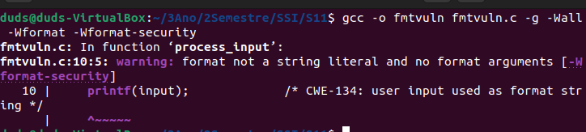
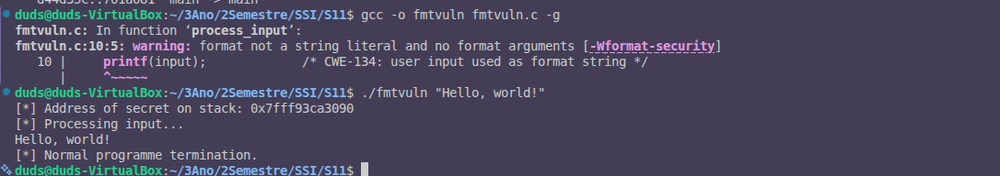

# Exercício 6: Análise de Vulnerabilidade de Format String

Parte B: Vulnerabilidades de String de Formato




---

## Compilação com Avisos de Segurança

Comando utilizado:
```bash
gcc -o fmtvuln fmtvuln.c -g -Wall -Wformat -Wformat-security
```

---

## Aviso Produzido pelo Compilador

```
fmtvuln.c: In function 'process_input':
fmtvuln.c:10:5: warning: format not a string literal and no format arguments [-Wformat-security]
   10 |     printf(input);             /* CWE-134: user input used as format string */
      |     ^~~~~~
```

---

## O que Indica a Mensagem de Aviso?

### Análise Detalhada

**Aviso:** `format not a string literal and no format arguments [-Wformat-security]`

**Significado:**
O compilador detectou que a função `printf()` está recebendo como primeiro argumento uma variável (`input`) em vez de uma string literal (constante). Isto é uma violação de segurança grave porque:

1. **Esperado (seguro):**
```c
printf("Hello %s\n", name);  // String literal com format specifié
```

2. **Detectado (PERIGOSO):**
```c
printf(input);  // Variável do utilizador como format string
```

---

## Por Quê É Perigoso?

### A Vulnerabilidade de Format String

Quando o utilizador controla a string de formato, pode:

1. **Ler dados da stack:** Usando `%x`, `%p`, `%s` para vazar informações
2. **Escrever na memória:** Usando `%n` para corromper dados arbitrários
3. **Executar código arbitrário:** Combinar com outras técnicas

### Exemplo de Ataque

Se o utilizador passa como input: `%x.%x.%x.%p`

O programa imprimiria valores da stack, vazando informações confidenciais.

---

## Flags de Compilação Utilizadas

| Flag | Função |
|------|--------|
| `-g` | Incluir símbolos de debug |
| `-Wall` | Ativar todos os avisos básicos |
| `-Wformat` | Avisos sobre erros em format strings |
| `-Wformat-security` | Avisos adicionais sobre format strings perigosas |

---

## O Que o Aviso Nos Diz

A mensagem de aviso específica `-Wformat-security` está a dizer:

> "O primeiro argumento de `printf()` não é uma string literal (constante), e não há argumentos de format adicionais. Isto é potencialmente uma vulnerabilidade de format string."

---

## CWE Associado

**CWE-134:** Use of Externally-Controlled Format String
- Descrição: Entrada do utilizador é usada como string de formato
- Risco: Leitura/escrita arbitrária de memória
- Impacto: Divulgação de informação, corrupção de dados, execução de código

---

## Recomendação de Segurança

**nao fazer**
```c
printf(input);  // Muito perigoso!
```

**fazer instead**
```c
printf("%s", input);  // Seguro - input é dado, não formato
```

Desta forma, qualquer `%x` ou `%n` no input é impresso como texto literal, não interpretado como especificador de formato.

---

## Parte 2: Compilação sem Flags de Aviso e Execução

O programa foi compilado sem as flags de aviso:

```bash
gcc -o fmtvuln fmtvuln.c -g
```

Em seguida, foi executado com uma entrada normal e benigna:

```bash
./fmtvuln "Hello, world!"
```

### Saída do Programa

```
[*] Processing input...
Hello, world!
[*] Normal programme termination.
```

### Análise do Comportamento

O programa se comportou como esperado, exibindo a mensagem fornecida como entrada sem apresentar erros ou comportamentos inesperados. No entanto, a vulnerabilidade de string de formato ainda está presente no código e pode ser explorada com entradas maliciosas.

---

## Importância dos Avisos do Compilador

Os avisos do compilador, como os gerados pelas flags `-Wformat` e `-Wformat-security`, são ferramentas úteis para identificar potenciais vulnerabilidades no código durante o processo de compilação. No entanto, eles não são suficientes para garantir a segurança do programa, pois:

1. **Cobertura Limitada:** Os avisos dependem de padrões conhecidos de vulnerabilidades e podem não detectar todos os problemas.
2. **Falsos Negativos:** Algumas vulnerabilidades podem passar despercebidas se não forem explicitamente verificadas pelo compilador.
3. **Falsos Positivos:** Em alguns casos, os avisos podem sinalizar problemas que não representam vulnerabilidades reais, levando a confusões ou ignorância dos avisos.

Portanto, os avisos do compilador devem ser utilizados em conjunto com outras práticas de segurança, como revisões de código, testes de segurança e ferramentas de análise estática mais avançadas.

---

## Conclusão

Com base nos resultados obtidos, os avisos do compilador são uma ferramenta valiosa para identificar vulnerabilidades de string de formato. No entanto, eles devem ser complementados com outras práticas de segurança para garantir a robustez do código contra ataques maliciosos.

