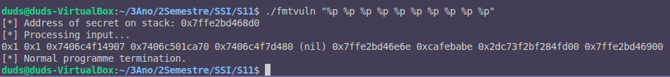
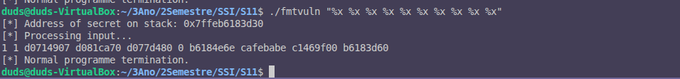

# Exercício 7

## Observações do Output

### Execução com `%p`:
```
./fmtvuln "%p %p %p %p %p %p %p %p %p %p"
[*] Address of secret on stack: 0x7ffe2bd468d0
[*] Processing input...
0x1 0x1 0x7406c4f14907 0x7406c501ca70 0x7406c4f7d480 (nil) 0x7ffe2bd46e6e 0xcafebabe 0x2dc73f2bf284fd00 0x7ffe2bd46900
[*] Normal programme termination.
```

### Execução com `%x`:
```
./fmtvuln "%x %x %x %x %x %x %x %x %x %x"
[*] Address of secret on stack: 0x7ffeb6183d30
[*] Processing input...
1 d0714907 d081ca70 d077d480 0 b6184e6e cafebabe c1469f00 b6183d60
[*] Normal programme termination.
```

## Imagens do Output

### Execução com `%p`:


### Execução com `%x`:


## Explicação do Mecanismo
Cada especificador `%p` ou `%x` faz com que o `printf` leia e imprima valores da stack. O `printf` não verifica se os argumentos correspondentes foram passados porque ele não tem informações sobre o número de argumentos reais. Ele apenas lê os valores da stack com base nos especificadores fornecidos na string de formato. Isso ocorre porque o `printf` usa a string de formato para determinar como acessar os argumentos na stack, mas não tem como verificar se os argumentos realmente existem.

## Diferenças entre `%p` e `%x`
Ao usar `%p`, o `printf` formata os valores como endereços de ponteiro, exibindo-os no formato hexadecimal com o prefixo `0x`. Já o `%x` exibe os valores em hexadecimal, mas sem o prefixo `0x` e sem o preenchimento com zeros à esquerda. Para um processo de 64 bits, o especificador `%p` é mais apropriado, pois ele exibe os endereços de memória no formato completo de 64 bits, enquanto `%x` pode não fornecer informações completas sobre os endereços devido à ausência do prefixo e do preenchimento.