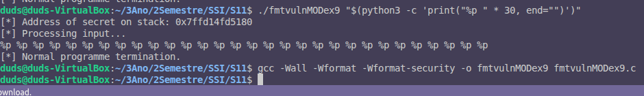

# Exercício 9: Eliminação da Vulnerabilidade de String de Formato

## Objetivo
Corrigir a vulnerabilidade de string de formato no programa `fmtvuln.c`.

## Linha de Código Corrigida
A linha corrigida no código é:
```c
printf("%s", user_input);
```

## Explicação da Correção
A vulnerabilidade de string de formato ocorre quando a entrada do utilizador é passada diretamente como string de formato para funções como `printf`. Isso permite que um atacante insira especificadores de formato (como `%p` ou `%x`) para explorar a memória do programa.

Na linha corrigida, a entrada do utilizador (`user_input`) é tratada como uma string literal com o especificador `%s`. Isso garante que qualquer conteúdo na entrada do utilizador seja interpretado apenas como texto e não como comandos de formato.

### Por que é Seguro?
- **Especificadores de Formato Ignorados:** Mesmo que a entrada contenha `%p` ou `%x`, eles serão exibidos literalmente como parte da string, sem serem interpretados.
- **Proteção Contra Exploração:** O atacante não pode acessar ou modificar a memória do programa usando especificadores de formato.

## Conclusão
Esta correção elimina a vulnerabilidade ao garantir que a entrada do utilizador seja tratada como dados e não como uma string de formato, protegendo o programa contra ataques de string de formato.

## Verificação da Correção

### Exercício 7: Entrada Não Divulga Valores da Stack
Após recompilar o programa corrigido e executar o comando:
```bash
./fmtvulnMODex9 "$(python3 -c 'print("%p " * 30, end="")')"
```
O output foi:
```
[*] Address of secret on stack: 0x7ffd14fd5180
[*] Processing input...
%p %p %p %p %p %p %p %p %p %p %p %p %p %p %p %p %p %p %p %p %p %p %p %p %p %p %p %p %p %p 
[*] Normal programme termination.
```
Isso confirma que a entrada do utilizador não divulga mais valores da stack. Os especificadores `%p` são exibidos como texto literal, eliminando a vulnerabilidade.

### Compilação com -Wall -Wformat -Wformat-security
O programa foi recompilado com os seguintes flags:
```bash
gcc -Wall -Wformat -Wformat-security -o fmtvulnMODex9 fmtvulnMODex9.c
```
Nenhum aviso foi produzido durante a compilação, confirmando que o código está seguro e em conformidade com as melhores práticas de segurança.

### Screenshot
